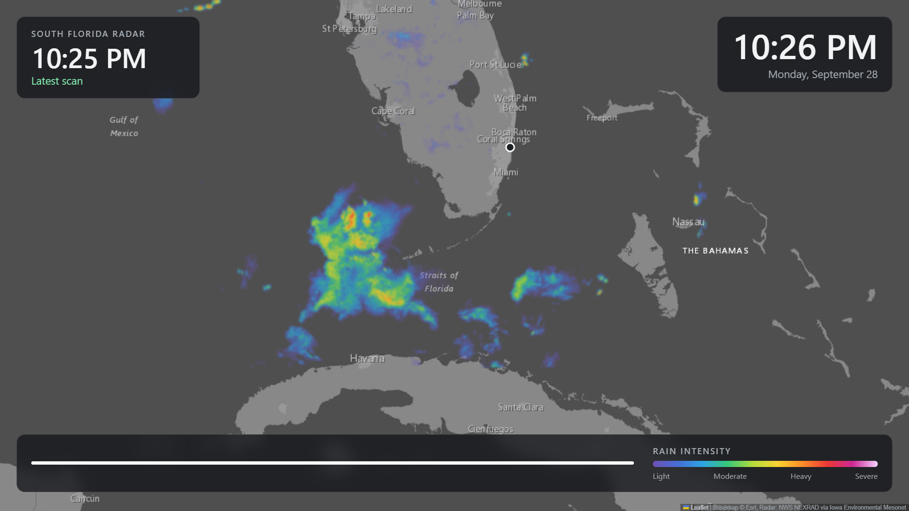
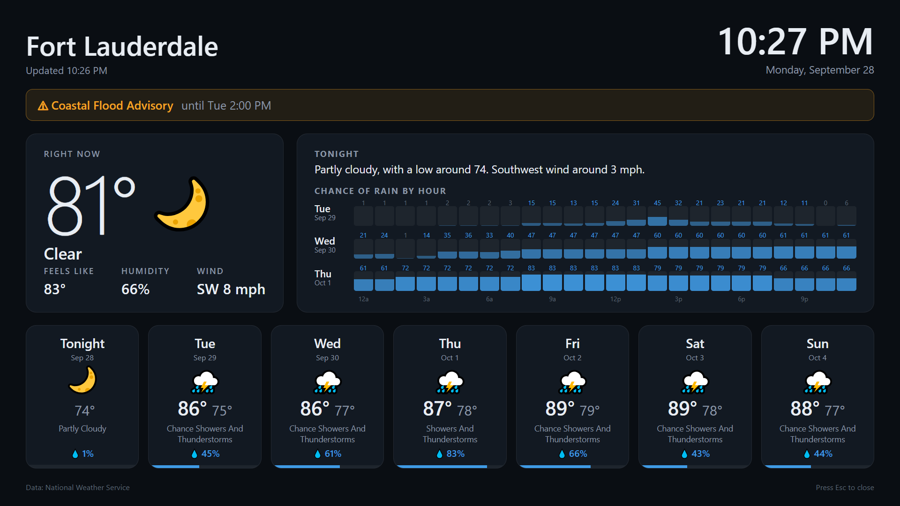

# Weather Wall

A morning weather display for Windows PCs with two monitors. Every morning it opens, full screen:

- **Left screen:** a live, animated weather radar in a Windy-style look.
- **Right screen:** current conditions, weather alerts, hourly rain chances for the next three days, and a 7-day forecast.

It turns the screens on when it opens, and closes itself at 10:30 AM.

## What you need

- Windows 10 or 11 with Google Chrome (or Microsoft Edge)
- Two monitors (it also works on one, with the windows stacked)
- A location in the US: forecast and radar data come from the National Weather Service

No accounts or API keys needed.

## Setup

1. Download this repo (green **Code** button > **Download ZIP**) and unzip it somewhere permanent, like `Documents\Weather Wall`.
2. Open `config.js` in Notepad and set your town's name, latitude and longitude, and the area the radar map should show.
3. Right-click `install.ps1` > **Run with PowerShell**.

This adds a **Weather Wall** shortcut to your Desktop and a daily task that opens it at 7:00 AM.

## Using it

- **Open it any time:** double-click the Desktop shortcut.
- **Close it:** press **Esc** on each screen, or wait for 10:30 AM.
- **Change the open time:** run `install.ps1` again with a new time, for example `.\install.ps1 -At '6:30 AM'`.
- **Change the close time:** edit `$closeTime` at the top of `launch.ps1`.
- **Remove it:** run `.\install.ps1 -Uninstall`.

## Good to know

- **Screen lock:** Windows doesn't let any app show on top of the lock screen. If your PC locks overnight, the weather will be waiting when you sign in.
- **Sleep:** if your PC sleeps overnight, it can only wake itself at 7 AM when wake timers are on: Control Panel > Power Options > Change plan settings > Change advanced power settings > Sleep > Allow wake timers > **Enable**.
- **Radar coverage:** radar comes from US weather radars, so it fades out a few hundred miles offshore.

## How it works

Two plain web pages (`radar.html`, `forecast.html`) run in Chrome's kiosk mode, one per monitor, each with its own browser profile so they never touch your normal browser. `launch.ps1` places the windows, keeps the screens awake, and closes everything at the close time. `launch.vbs` starts it without a console window flashing.

Data sources, all free:
- Forecast, current conditions, alerts: [National Weather Service API](https://www.weather.gov/documentation/services-web-api)
- Radar: NWS NEXRAD composite via [Iowa Environmental Mesonet](https://mesonet.agron.iastate.edu/), recolored in the browser
- Map: Esri Dark Gray Canvas
